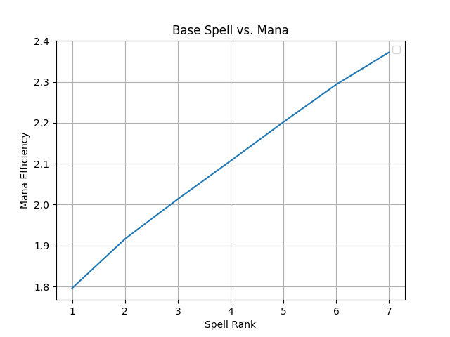
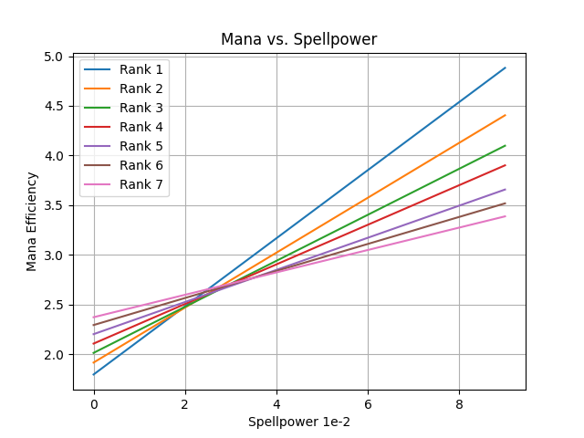
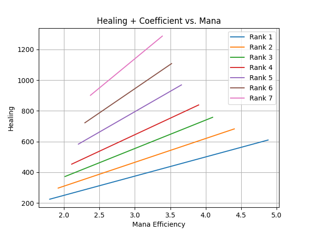

# Priest Flash Heal Spellpower and Rank Comparisons
View various attributes of spellpower, mana, and ranks for Priest Flash Heal spells

## An Introduction

In the game of 21 players draw randomly sorted cards until the sum of their cards equals 21, or have the highest sum among the players without going over 21.
Healers face an interesting problem: Like the game of 21 they must be able to heal a damaged player as close to full as possible without (significant) overhealing. This game occurs literally thousands of times over the course of a single raid, where overhealing may cause the healer to run out of mana (its primary resource) when the raid needs it most. Raid healers have an added difficulty in that they have to coordinate with each other to reduce overhealing; it would be like playing 21 together and some penalty is incurred by the team if anyone goes over 21.

Significant overhealing is inefficient and reduces the healer's endurance during a fight, increases raid downtime to drink, and may impose real cost in the need to purchase more consumables (both on the part of the healer as well as those being - or would be - healed).

---

## An Example
In the course of this exercise we will explore the most mana efficient spells by looking at the spell rank, spellpower and its coefficient, and its mana cost.

A Priest's Flash Heal Rank 7 spell heals an average of 901 hitpoints at a cost of 380 mana, a ratio of 2.37 hitpoints per mana. The higher the ratio the more mana efficient the spell.

The graph above demonstrates the mana efficiency of each rank of Flash Heal. Interestingly, higher ranked base spells are increasingly more efficient to use, but cost more mana. As long as there is sufficient mana and assuming there is no penalty for overhealing, casting with the highest ranked spell is the most efficient.
- If the emphasis is healing amount, higher ranks are better
- If the emphasis is mana conservation, especially in longer fights or where damage relatively light, lower ranks are better

While these points are obvious, a game of 21 can't be won by playing only the lowest, or the highest, cards. Some combination or compromise is required to ensure the sum doesn't go over 21.

---

## Spellpower to Healing Comparison

Spellpower has a powerful impact on healing as it is essentially an additive, free effect on top of the base heal. The spellpower coefficient is calculated as: *spellpower / 3.5 * 1.5*; if the spellpower is 500 then the effective spell coefficient is ~214 added healing, bringing the power of Flash Heal Rank 7 to 1,115 *at the same mana cost* as the base spell. It's mana to health, or efficiency, ratio increases from 2.37 to 2.93.

> Base formula
>
> `( ( Spellpower / 3.5 * 1.5 ) + Base spell effect ) / Mana = Mana to Heal Ratio`

> Base Spell without Spellpower
> 
> `( ( 0 / 3.5 * 1.5 ) + 901 / 380 = 2.37`

> Base Spell with 500 Spellpower
> 
> `( ( 500 / 3.5 * 1.5 ) + 901 / 380 = 2.93`

While spellpower increases the overall healing as well as the mana to healing ratio, it can create scenarios for overhealing. Considering the following  example:

A damage-over-time spell is applied to a player at a rate of 500 damage per one and a half seconds for 2 minutes. A Priest with 900 spellpower may choose to cast one of three ranks:
- Rank 1 for ~280 healing at 125 mana
    - Results in no overhealing and one dead player
- Rank 4 for ~820 healing at 215 mana
    - Results in overhealing at a cost of 115 mana
- Rank 7 for ~1200+ healing at 380 mana
    - Results in overhealing at a cost of 222 mana

If Flash Heal is cast 80 times over the course of the 2 minutes, this will result in 9,200 and 17,760 mana used in overhealing for Rank 4 and Rank 7, respectively. That mana equates to 35,088 and 56,084 health.

> Example: Mana Cost for Overheal with Rank 7
> 
> `( ( ( spellpower / 3.5 * 1.5 + base damage ) as sp - damage over time tick amount / sp * mana cost * time of fight / cast time ) )`
> 
> `(( ( 900 / 3.5 * 1.5 ) + 901) as sp - 500 / sp * 380 * 120 / 1.5`

---

## Spellpower to Mana Comparison

### Disclaimer: This section may be misintrepeted to mean lower ranked spells are more efficient than higher ranked spells. This is not true in itself. However, lower ranked spells are more efficient when coupled with increased spellpower.

This graph shows an interesting phenomenon that seems counterintuitive. Lower ranked spells respond more to increased spellpower, or rather spellpower has more impact on lower ranked spells. Here are some observations:
- Lower ranked spells cost less mana in absolute terms. Therefore, they have more to gain from increased spellpower.
- Lower ranked spells are significantly less efficient than higher ranks, but adding spellpower also increases their efficiency more quickly than higher ranks.
- This view of the data proves that downranking can be a viable, efficient strategy so long as there is enough increased spellpower.

Note that the distance between ranks close as the rank becomes higher. This suggests an interesting detail observed in the subsequent section.

---

## Mana to Healing Comparison

While the previous section shows that spellpower has a greater effect on lower ranked spells, the above graph shows that absolute healing at higher ranks increases more quickly with less mana efficiency.